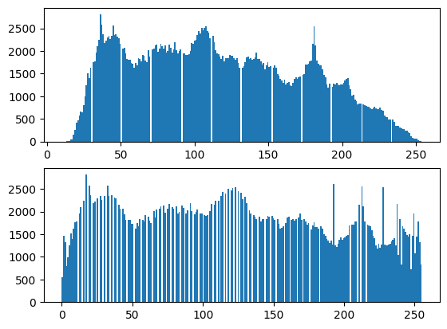

<div align=center></div>
<div align=center></div>
<div align = 'center'>
    <font size = '20'><b>本科实验报告</b></font>
</div>


|   姓名：   |       沈骏一       |
| :--------: | :----------------: |
|   学院：   | 控制科学与工程学院 |
|   专业：   |   自动化（控制）   |
|   学号：   |     3200100259     |
| 指导教师： |        姜伟        |

<div align = 'center'>
    <font size = '5'><b>2023年3月9日</b></font>
</div>

 <div align = 'center'>
    <font size = '5'><b> DIP 直方图均衡作业</b></font>
</div>

1. 利用Opencv工具包进行图片读入操作。

```python
import cv2
ori=cv2.imread('xaun.png',cv2.IMREAD_REDUCED_COLOR_2)
cv2.imshow('Origin',ori)
cv2.waitKey()
```


2. 利用`cv2.cvtColor`函数将彩色图片转化为灰度图片


```python

gray = cv2.cvtColor(ori,cv2.COLOR_RGB2GRAY)
cv2.imshow('Gray',gray)
cv2.waitKey()
```


cv2.calcHist()函数  ：

        通过直方图可以很好的对整幅图像的灰度分布有一个整体的了解，直方图的x轴是灰度值（0~255），y轴是图片中具有同一个灰度值的点的数目。 
        而calcHist（）函数则可以帮助我们统计一幅图像的直方图。

3. 直接掉包进行直方图的绘制


```python
import matplotlib.pyplot as plt
cv2.calcHist([gray],[0],None,[256],[0,256])
plt.hist(gray.ravel(),256);
plt.show()
```


    4. 同样的，将直方图运用到三通道，绘制RGB三色的直方图

```python
import matplotlib.pyplot as plt
color = ('b','g','r')
for i,col in enumerate(color): 
    histr = cv2.calcHist([ori],[i],None,[256],[0,256]) 
    plt.plot(histr,color = col) 
    plt.xlim([0,256]) 
    print(i,col)
```

    0 b
    1 g
    2 r


    5. 利用`cv2.equalizeHist(img)`函数进行自动直方图均衡化操作


cv2.equalizeHist(img)

        参数：img表示输入的图片
    
        作用：表示进行直方图均衡化


```python
import numpy as np
ret = cv2.equalizeHist(gray)
plt.subplot(211)
plt.hist(gray.ravel(), 256)
plt.subplot(212)
plt.hist(ret.ravel(), 256)
plt.show()
cv2.imshow('ret', np.hstack((gray, ret)))
cv2.waitKey(0)
```


  

6. 利用`cv2.createCLAHA(clipLimit, titleGridSize) `函数生成自适应均衡化图像

cv2.createCLAHA(clipLimit, titleGridSize) 

        参数：clipLimit颜色对比度的阈值
    
                   titleGridSize进行像素均衡化的网格大小，即在多少网格下进行直方图的均衡化操作
    
        作用： 用于生成自适应均衡化图像


```python
clahe = cv2.createCLAHE(clipLimit=2.0,tileGridSize=(8, 8))
clahe = clahe.apply(gray)
cv2.imshow('imgs', np.hstack((gray, ret, clahe)))
cv2.waitKey(0)
```


7. 自主编写函数实现彩色/黑白的直方图均衡化操作


```python
import matplotlib.pyplot as plt
import numpy as np
def Hist_transform(src,mode=0):
    reflection = []
    tgt = np.copy(src)
    if mode == 1:
        color = ('b','g','r')
        for i,col in enumerate(color):
            histr = cv2.calcHist([src],[i],None,[256],[0,256])  
            plt.subplot(211)
            plt.plot(histr,color = col) 
            plt.xlim([0,256])     
            for j in range(0,256):
                reflection.append(int(np.sum(histr[:j])/np.sum(histr)*256))
            for a in range(0,src.shape[0]):
                for b in range(0,src.shape[1]):
                    tgt[a][b][i]=reflection[src[a][b][i]]
            hist2 = cv2.calcHist([tgt],[i],None,[256],[0,256]) 
            plt.subplot(212)
            plt.plot(hist2,color = col) 
            plt.xlim([0,256])
            plt.ylim([0,6000])
    else:
        histr = cv2.calcHist([src],[0],None,[256],[0,256])  
        plt.subplot(211)
        plt.hist(gray.ravel(), 256)
        for j in range(0,256):
                reflection.append(int(np.sum(histr[:j])/np.sum(histr)*256))
        for a in range(0,src.shape[0]):
            for b in range(0,src.shape[1]):
                tgt[a][b]=reflection[src[a][b]]
        plt.subplot(212)
        plt.hist(tgt.ravel(), 256)
        plt.show()
    return tgt

tgt=Hist_transform(gray)
cv2.imshow('result', np.hstack((gray, tgt)))
cv2.waitKey()
```


  均衡化前后效果对比：


在面部细节与头发上具有更高的对比度和饱和度。

彩色直方图对比：


8. 实验总结：

   经过本次实验，基本掌握了通过Opencv工具包对图像进行一些基本处理的函数，同时，自主自主编写程序完成了对与直方图的绘制与直方图均衡操作的实现，进行了简单的图像增强处理。
