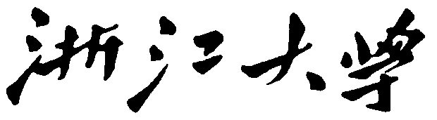

<div align=center></div>

<div align=center></div>

<div align = 'center'>
    <font size = '20'><b>本科实验报告</b></font>
</div>

<div align = 'center'>

|   姓名：   |       沈骏一       |
| :--------: | :----------------: |
|   学院：   | 控制科学与工程学院 |
|   专业：   |   自动化（控制）   |
|   学号：   |     3200100259     |
| 指导教师： |        姜伟        |
</div>

<div align = 'center'>
    <font size = '5'><b>2023年5月20日</b></font>
</div>
 <div align = 'center'>
    <font size = '5'><b> DIP 相机标定</b></font>
</div>

### 	**制作并拍照标定板图像（或者使用课程提供标定图像），实现张正友方法标定相机，截屏提交相机内、外参数标定结果，以及反投影误差可视化界面。**

本作业主要采用了`Matlab R2023a`软件中的`Computer Vision Toolsbox`中的`Camera Colibrator`功能块实现。软件界面如下图所示：


添加给定的相机标定图像，设置对应的标定方块大小为`10mm`，畸变程度为`High`。


导入图片后，可以发现App自动为我们标记了图像中存在的角点。


点击`Calabrate`开始相机标定。标定结果如下所示：


导出相机参数：


以及对应的标定误差矩阵：


绘制标定过程中的误差图像（反投影误差可视化界面）：


以及标定过程中的相机与标定板的相对位姿：


此外，可以自动生成标定过程代码：
```matlab
% Auto-generated by cameraCalibrator app on 20-May-2023
%-------------------------------------------------------


% Define images to process
imageFileNames = {'C:\Users\10037\Desktop\DIP\Task5\Board\c-0000.ppm',...
    'C:\Users\10037\Desktop\DIP\Task5\Board\c-0002.ppm',...
    'C:\Users\10037\Desktop\DIP\Task5\Board\c-0003.ppm',...
    'C:\Users\10037\Desktop\DIP\Task5\Board\c-0004.ppm',...
    'C:\Users\10037\Desktop\DIP\Task5\Board\c-0005.ppm',...
    'C:\Users\10037\Desktop\DIP\Task5\Board\c-0006.ppm',...
    'C:\Users\10037\Desktop\DIP\Task5\Board\c-0007.ppm',...
    'C:\Users\10037\Desktop\DIP\Task5\Board\c-0008.ppm',...
    'C:\Users\10037\Desktop\DIP\Task5\Board\c-0009.ppm',...
    'C:\Users\10037\Desktop\DIP\Task5\Board\c-0010.ppm',...
    'C:\Users\10037\Desktop\DIP\Task5\Board\c-0011.ppm',...
    'C:\Users\10037\Desktop\DIP\Task5\Board\c-0012.ppm',...
    'C:\Users\10037\Desktop\DIP\Task5\Board\c-0013.ppm',...
    'C:\Users\10037\Desktop\DIP\Task5\Board\c-0014.ppm',...
    'C:\Users\10037\Desktop\DIP\Task5\Board\c-0015.ppm',...
    'C:\Users\10037\Desktop\DIP\Task5\Board\c-0016.ppm',...
    'C:\Users\10037\Desktop\DIP\Task5\Board\c-0017.ppm',...
    'C:\Users\10037\Desktop\DIP\Task5\Board\c-0018.ppm',...
    'C:\Users\10037\Desktop\DIP\Task5\Board\c-0019.ppm',...
    'C:\Users\10037\Desktop\DIP\Task5\Board\c-0020.ppm',...
    'C:\Users\10037\Desktop\DIP\Task5\Board\c-0021.ppm',...
    'C:\Users\10037\Desktop\DIP\Task5\Board\c-0022.ppm',...
    'C:\Users\10037\Desktop\DIP\Task5\Board\c-0023.ppm',...
    'C:\Users\10037\Desktop\DIP\Task5\Board\c-0024.ppm',...
    'C:\Users\10037\Desktop\DIP\Task5\Board\c-0025.ppm',...
    'C:\Users\10037\Desktop\DIP\Task5\Board\c-0026.ppm',...
    };
% Detect calibration pattern in images
detector = vision.calibration.monocular.CheckerboardDetector();
[imagePoints, imagesUsed] = detectPatternPoints(detector, imageFileNames, 'HighDistortion', true);
imageFileNames = imageFileNames(imagesUsed);

% Read the first image to obtain image size
originalImage = imread(imageFileNames{1});
[mrows, ncols, ~] = size(originalImage);

% Generate world coordinates for the planar pattern keypoints
squareSize = 10;  % in units of 'millimeters'
worldPoints = generateWorldPoints(detector, 'SquareSize', squareSize);

% Calibrate the camera
[cameraParams, imagesUsed, estimationErrors] = estimateCameraParameters(imagePoints, worldPoints, ...
    'EstimateSkew', false, 'EstimateTangentialDistortion', false, ...
    'NumRadialDistortionCoefficients', 2, 'WorldUnits', 'millimeters', ...
    'InitialIntrinsicMatrix', [], 'InitialRadialDistortion', [], ...
    'ImageSize', [mrows, ncols]);

% View reprojection errors
h1=figure; showReprojectionErrors(cameraParams);

% Visualize pattern locations
h2=figure; showExtrinsics(cameraParams, 'CameraCentric');

% Display parameter estimation errors
displayErrors(estimationErrors, cameraParams);

% For example, you can use the calibration data to remove effects of lens distortion.
undistortedImage = undistortImage(originalImage, cameraParams);

% See additional examples of how to use the calibration data.  At the prompt type:
% showdemo('MeasuringPlanarObjectsExample')
% showdemo('StructureFromMotionExample')

```

得到相机的内外参数矩阵与不确定度：

内参矩阵：

```matlab
Intrinsics
----------
Focal length (pixels):   [  688.0535 +/- 1.5070      688.3620 +/- 1.4749  ]
Principal point (pixels):[  336.2424 +/- 0.4799      273.2100 +/- 0.3981  ]
Radial distortion:       [    0.3454 +/- 0.0060       -0.9097 +/- 0.0227  ]
```

外参矩阵：

```MAtlab
Extrinsics
----------
Rotation vectors:
                         [   -0.2194 +/- 0.0013       -0.2602 +/- 0.0014        0.0427 +/- 0.0003  ]
                         [   -0.2392 +/- 0.0021        0.1091 +/- 0.0019        0.8823 +/- 0.0004  ]
                         [    0.3936 +/- 0.0015        0.2922 +/- 0.0015       -1.5573 +/- 0.0004  ]
                         [   -0.6528 +/- 0.0018        0.3147 +/- 0.0018       -1.4995 +/- 0.0005  ]
                         [    0.0705 +/- 0.0022       -0.4505 +/- 0.0021       -1.6678 +/- 0.0004  ]
                         [    0.0743 +/- 0.0037        0.1412 +/- 0.0029        0.0300 +/- 0.0005  ]
                         [   -0.3214 +/- 0.0021        0.1431 +/- 0.0019       -0.0813 +/- 0.0003  ]
                         [   -0.2078 +/- 0.0026       -0.1520 +/- 0.0027       -0.0379 +/- 0.0005  ]
                         [    0.1862 +/- 0.0021       -0.5108 +/- 0.0021       -1.4172 +/- 0.0007  ]
                         [    0.4250 +/- 0.0016       -0.6601 +/- 0.0016       -1.3946 +/- 0.0007  ]
                         [    0.6084 +/- 0.0014        0.1116 +/- 0.0014       -1.4220 +/- 0.0005  ]
                         [   -0.2662 +/- 0.0029        0.4928 +/- 0.0028       -1.4596 +/- 0.0006  ]
                         [    0.0055 +/- 0.0025       -0.2135 +/- 0.0024       -1.4311 +/- 0.0007  ]
                         [   -0.1848 +/- 0.0024       -0.0067 +/- 0.0025       -1.6558 +/- 0.0006  ]
                         [    0.1331 +/- 0.0045       -0.4201 +/- 0.0044       -0.0507 +/- 0.0009  ]
                         [   -0.1368 +/- 0.0074       -0.3336 +/- 0.0062        0.0252 +/- 0.0012  ]
                         [    0.0375 +/- 0.0025       -0.1212 +/- 0.0025       -0.0515 +/- 0.0006  ]
                         [    0.0227 +/- 0.0029       -0.0724 +/- 0.0028       -0.0441 +/- 0.0007  ]
                         [   -0.0768 +/- 0.0013        0.8625 +/- 0.0013       -0.0735 +/- 0.0005  ]
                         [    0.2899 +/- 0.0013       -0.5674 +/- 0.0013       -0.0732 +/- 0.0006  ]
                         [   -0.1244 +/- 0.0024        0.1913 +/- 0.0020        0.0491 +/- 0.0003  ]
                         [   -0.1143 +/- 0.0037       -0.2246 +/- 0.0036       -1.5417 +/- 0.0005  ]
                         [    0.5862 +/- 0.0017        0.0936 +/- 0.0018       -1.8903 +/- 0.0004  ]
                         [   -0.3085 +/- 0.0014       -0.5608 +/- 0.0014        0.2117 +/- 0.0004  ]
                         [   -0.2236 +/- 0.0015        0.4224 +/- 0.0016       -0.5794 +/- 0.0004  ]
                         [   -0.2122 +/- 0.0028        0.0103 +/- 0.0027        0.0428 +/- 0.0005  ]

Translation vectors (millimeters):
                         [   -8.9354 +/- 0.1085      -21.5075 +/- 0.0887      155.5847 +/- 0.3447  ]
                         [    7.6384 +/- 0.1315      -49.8987 +/- 0.1048      192.1494 +/- 0.4137  ]
                         [    5.5505 +/- 0.1325       39.4952 +/- 0.1039      186.5780 +/- 0.3785  ]
                         [   12.1553 +/- 0.1376       37.6907 +/- 0.1048      189.0829 +/- 0.4010  ]
                         [  -41.3122 +/- 0.1167       34.0744 +/- 0.0955      156.4615 +/- 0.4011  ]
                         [   -7.1282 +/- 0.1293      -58.9527 +/- 0.1102      189.5886 +/- 0.4472  ]
                         [  -19.1207 +/- 0.1217      -11.9249 +/- 0.1039      179.9629 +/- 0.3775  ]
                         [   18.4179 +/- 0.1986      -21.0853 +/- 0.1599      278.0960 +/- 0.6600  ]
                         [   -6.4326 +/- 0.1744       39.0539 +/- 0.1485      245.7744 +/- 0.6060  ]
                         [   -5.6406 +/- 0.1729       35.1263 +/- 0.1440      243.8540 +/- 0.5982  ]
                         [   -1.1040 +/- 0.1569       49.0904 +/- 0.1250      221.0915 +/- 0.4778  ]
                         [   20.4968 +/- 0.1766       35.6226 +/- 0.1394      244.1935 +/- 0.5031  ]
                         [   48.2483 +/- 0.1862       39.8374 +/- 0.1546      258.2710 +/- 0.6329  ]
                         [  -96.5524 +/- 0.1775       39.2455 +/- 0.1425      247.5304 +/- 0.6182  ]
                         [  -95.8787 +/- 0.1946      -84.6237 +/- 0.1715      253.8528 +/- 0.7065  ]
                         [ -104.3541 +/- 0.2228       13.4139 +/- 0.1600      264.8784 +/- 0.7317  ]
                         [   27.5115 +/- 0.1825       16.1957 +/- 0.1555      259.0958 +/- 0.6333  ]
                         [   32.4199 +/- 0.1923      -86.6596 +/- 0.1679      271.2959 +/- 0.6815  ]
                         [   -5.4316 +/- 0.1799       -2.5176 +/- 0.1477      252.8906 +/- 0.4901  ]
                         [   10.2566 +/- 0.1552       -5.7481 +/- 0.1298      218.7081 +/- 0.5522  ]
                         [  -17.6553 +/- 0.1135      -27.9702 +/- 0.0945      168.6799 +/- 0.3657  ]
                         [  -24.6910 +/- 0.1445       42.9960 +/- 0.1307      205.1269 +/- 0.5117  ]
                         [  -10.7783 +/- 0.1253       29.9190 +/- 0.1041      181.3004 +/- 0.3702  ]
                         [  -36.7390 +/- 0.1210      -22.0254 +/- 0.0997      173.4120 +/- 0.4050  ]
                         [  -29.0157 +/- 0.1251       -3.7847 +/- 0.1031      182.1994 +/- 0.3557  ]
                         [    4.8120 +/- 0.1610      -26.0611 +/- 0.1297      228.7494 +/- 0.5134  ]
```

项目结果保存在：‘calibrationSession.mat’